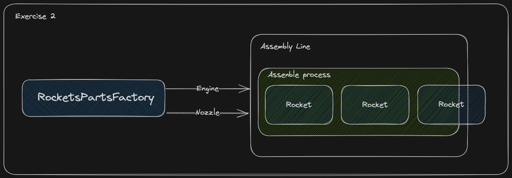

# Exercise 2. New parts, new models, new families!

## Description

Great job on completing the first task! However, the work does not stop there, as **`Platzi-X`** has ambitious plans for the future, including the launch of their first two named rocket families:

1. The **`Platzi-X Galaxy (PG001)`**, named in honor of the vast and expansive Platzi community, is a **`Solid-Fuel Rocket`** that uses a **`Single Nozzle`**.
2. The **`Platzi-X Odyssey (PO001)`**, named after the long and challenging journey of learning, is a **`Liquid-Fuel Rocket`** uses a **`Double Nozzle`**.

Currently, the plan is for each rocket family to require its own engine and nozzle, which will be manufactured in dedicated factories. **`The Galaxy Factory`** will produce the necessary engine and nozzle for its rocket family, while the **`Odyssey Factory`** will do the same.

The company wants to achieve consistency across all rocket families factories behavior, so the team has agreed to define a common behavior plan to reach this. This behavior should include the creation processes for the engine and the nozzle.

The factories used for the liquid and solid rockets have been consolidated into a **`Single Factory with an Assembly Line`**. The rocket parts need to be passed to assembly line **`before rockets assembling`**.

## Implementation plan

1. Create `RocketPartsFactory` common entity that defines the creation process for each of the rocket parts.
2. For each rocket family create its own parts factory. These factories must implement the common factory behavior and return valid values for use in rocket assembling. The name of these factories should follow the format: `{Odyssey|Galaxy} + PartsFactory`. Remember export them.
3. Implement the `createNozzle` and `createEngine` methods in each factory to return the valid values required for the **`Galaxy`** and the **`Odissey`** specifications.
4. Complete `assemblingLine` set methods for each one of the parts.
5. Before the rocket assemble process, it is crucial to ensure that both, the engine and nozzle are present in the assembling line. **`Without these components, the rocket cannot be completed`**.
6. The assembly process takes a rocket as a parameter, which will not have all the parts initially. The process then sets the missing parts on the rocket and returns the same rocket with everything properly settled.

## Code Examples

```js
// Galaxy parts factory
const galaxyPartsFactory = new GalaxyPartsFactory();
const engine = galaxyPartsFactory.createEngine();
const nozzle = galaxyPartsFactory.createNozzle();

// Odyssey rocket creation
const galaxyRocket = new Rocket({
  model: 'Galaxy001',
  category: 'valkyria',
});

galaxyRocket.engine = engine;
galaxyRocket.nozzle = nozzle;
```

```js
// Odyssey parts factory
const odysseyPartsFactory = new OdysseyPartsFactory();
const engine = odysseyPartsFactory.createEngine();
const nozzle = odysseyPartsFactory.createNozzle();

// Odyssey rocket creation
const odisseyRocket = new Rocket({
  model: 'Odissey001',
  category: 'hermes',
});

odisseyRocket.engine = engine;
oddiseyRocket.nozzle = nozzle;
```

## Resources

In the Resources section, you'll find links to Platzi classes that cover the tools and skills required to complete this task and an image that explains what the challenge tries to solve.



[Link to class](https://platzi.com/clases/6933-patrones-diseno-creacionales/60873-implementacion-de-abstract-factory-en-js/)
