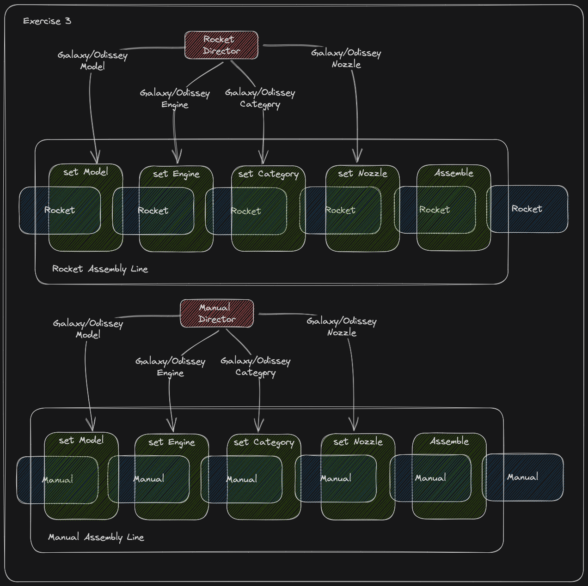

The **`Galaxy`** and **`Odyssey`** rockets were such a success that they are now being sold at a reduced cost to those who want to use them for research or academic purposes. And the best part? Each rocket purchase comes with a **`Manual`**!.

To keep things organized and efficient, the manuals are produced in the same factory as the rockets, **`but on a separate production line`**. This means that each manual will contain all the necessary information for operating the rocket effectively.

The process for creating the manual follows similar steps to that of the rocket assembly process, with the same components like the engine and nozzle being used. **`The difference is the returned product in the assemble process`**.

To oversee the production of both the rockets and manuals, there will be two **`product directors`**: one for the rockets and one for the manuals.

## Implementation plan

1. Complete the implementation of all the steps in **`Assembling Line`** common entity. The format of the names will be `set + {RocketComponent}`.
2. Complete the implementation of assembling lines for **`Rockets`** and **`Manuals`**. Assemble process on each line must return the correct product with all the properties settled.
3. Before the assemble process return the product **`we need to verify that all product parts in production line have valid values, without these components the product cannot be completed`**. Use the validation method to reach this.
4. Complete the build steps for each product (**`Galaxy`**, **`Odissey`**) in **`Director`** entity, use the assembling line methods to set the properties values.
   1. **`Galaxy`**:
      1. Model: Galaxy
      2. Engine: solid
      3. Category: valkyria
      4. Nozzle: single
   2. **`Odissey`**:
      1. Model: Odissey
      2. Engine: liquid
      3. Category: hermes
      4. Nozzle: double
5. `Rocket` and `Manual` products have an error that is breaking everything, could you help to fix it?

## Code Examples

```js
// The assemble line receive initial rocket
const rocketAssemblyLine = new RocketAssemblyLine({ product: new Rocket() })

// The Rocket Director will work with the assembly line
const rocketDirector = new Director({
	assemblyLine: rocketAssemblyLine;
});

rocketDirector.buildGalaxyProduct();
const rocket = rocketAssemblyLine.assemble();
```

## Resources

In the Resources section, you'll find links to Platzi classes that cover the tools and skills required to complete this task and an image that explains what the challenge tries to solve.
<<<<<<< HEAD



[Link to class](https://platzi.com/clases/6933-patrones-diseno-creacionales/60878-implementacion-de-builder-en-js/)
=======
>>>>>>> creational
